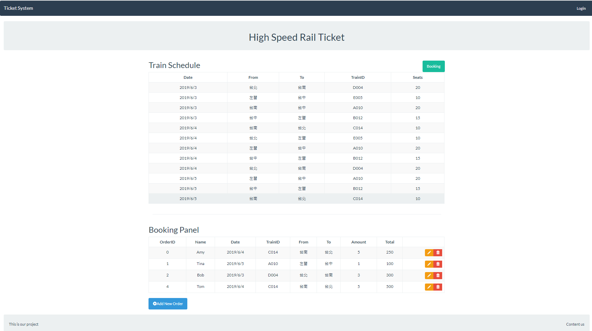

# Simple Train Ticket Reservation System with Flask


This project is built with Python Flask, Bootstrap and JQuery  





## Requirement

Python 3.6.5
Flask 1.0.2
Flask-Cors 3.0.4
Flask-MySQLdb 0.2.0 
PyMySQL 1.0.2
SQLAlchemy 1.2.7
Pandas 0.23.0

## Installation

1. Clone this repository

2. Install dependencies

   ```
   pip install -r requirements.txt
   ```


## Usage

```
   python App.py
```


