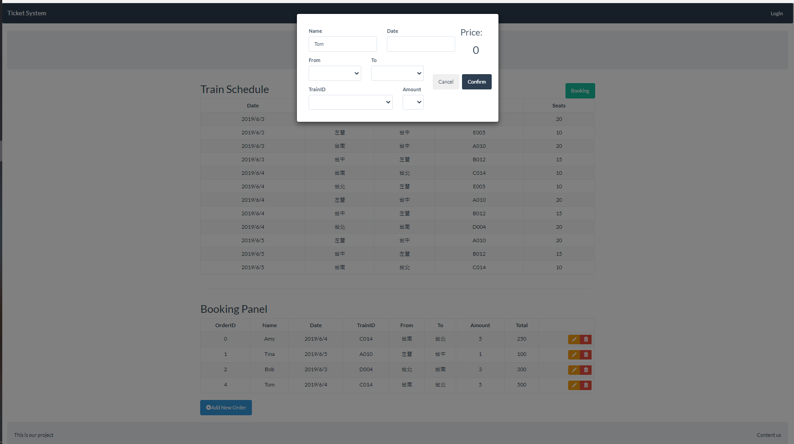
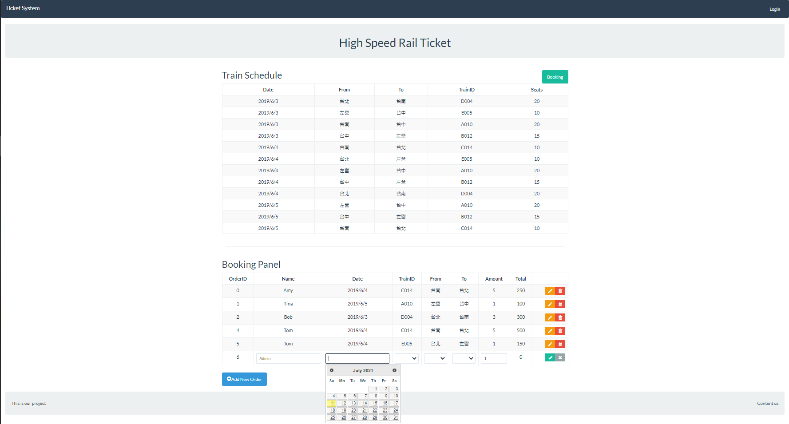

# Simple Train Ticket Reservation System with Flask


This project is built with Python Flask, Bootstrap and JQuery.

This system simply implements basic CRUD features for the booking list table and queries available trains, seats, and prices from the train schedule table.

Using AJAX or form submit to communicate with server side.    






## Requirement

Python 3.6.5
Flask 1.0.2
Flask-Cors 3.0.4
Flask-MySQLdb 0.2.0 
PyMySQL 1.0.2
SQLAlchemy 1.2.7
Pandas 0.23.0

## Installation

1. Clone this repository

2. Install dependencies


## Usage
0. Create your DB in MySQL :
	```sql
   CREATE DATABASE *****;  // your DB name 
	```
1. Create default Tables:
   Remember to fix DB username and password in file.
```
   python dbCreate.py
```
2. Execute system:
   Remember to fix DB username and password in file.
```
   python App.py
```


